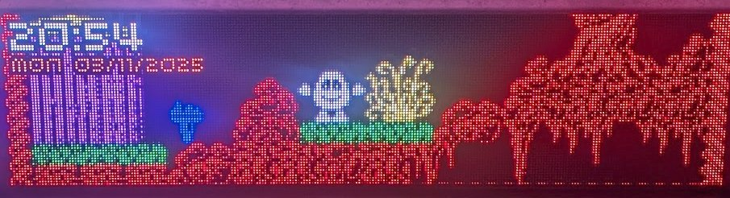
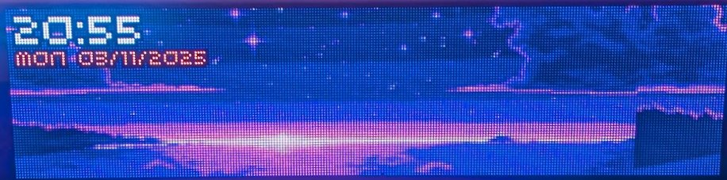
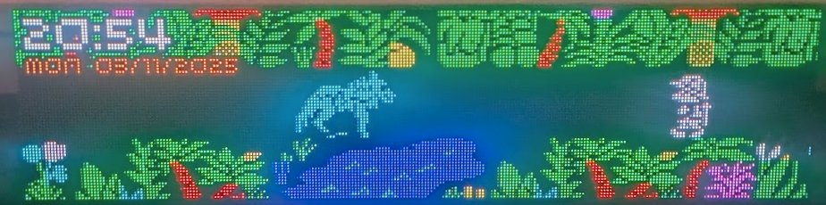

# 🎨 Pixelart Clock

> A dynamic, scene-based clock for the **Pimoroni Interstate 75W** LED matrix display

Transform your Interstate 75W into a living canvas that combines beautiful pixel art with time display. Whether you're nostalgic for 8-bit classics, love cyberpunk aesthetics, or want cozy winter scenes, this clock brings your LED matrix to life with smooth scrolling backgrounds, animated vector graphics, and a fully customizable scene system.

## 📸 See It In Action

<div align="center">


*Classic ZX Spectrum game scenes with smooth scrolling*


*Vibrant pixel art landscapes that slowly scroll across the display*


*Nostalgic pixel art from beloved retro games*

</div>

## ✨ Features

- **🎬 Multiple Scene Types**: Static images, scrolling backgrounds, animated vector graphics, and more
- **🌓 Day/Night Modes**: Automatic brightness control with dimmed night variants
- **⏰ Smart Scheduling**: Configure when your display is on, in normal mode, or night mode
- **🎮 Built-in Scenes**: Retro gaming scenes, cyberpunk landscapes, 3D cubes, Tetris, and Asteroids
- **🎨 Easy Customization**: Add your own pixel art with simple configuration
- **💾 Memory Efficient**: Designed for MicroPython's limited resources
- **📅 Flexible Date/Time**: Customizable date and time formats with 12/24-hour support

## 🖼️ Built-in Scenes

### Vector Graphics Scenes

#### **CubeScene** - 3D Wireframe Cubes
Rotating 3D wireframe cubes with color-cycling animation. Perfect for a hypnotic, geometric display.
```python
("CubeScene", (), {"num_cubes": 3})
```

#### **TetrisScene** - Automated Tetris Simulation
Watch Tetris pieces fall, rotate, and stack up automatically. Features all 7 classic Tetris shapes with random movements and automatic grid resets.
```python
("TetrisScene", (), {"fall_speed": 0.1, "reset_interval": 60.0})
```

#### **AsteroidsScene** - Classic Asteroids Arcade Game
Experience the classic Asteroids arcade game with an automated ship that thrusts, rotates, and fires lasers. Asteroids split into smaller pieces when destroyed, creating dynamic retro gameplay.
```python
("AsteroidsScene", (), {"num_asteroids": 5})
```

**Features:**
- Vector-based wireframe graphics (ship, asteroids, lasers)
- Automated ship with 70% thrust frequency and 50% rotation frequency
- Asteroids split on destruction: Large → Medium → Small
- Fast-moving laser projectiles with collision detection
- Screen-wrapping physics for authentic arcade feel
- Perfect for night mode with cyan ship, gray asteroids, and yellow lasers

### Image-Based Scenes

#### **ScrollingImageScene** - Smooth Horizontal Scrolling
Perfect for wide pixel art landscapes. Your image scrolls continuously across the display.
```python
("ScrollingImageScene", ("images/scene_neon_city.png",), {"scroll_speed": 1})
```

#### **StaticImageScene** - Static Display
Display your favorite pixel art without animation, great for detailed scenes you want to appreciate.
```python
("StaticImageScene", ("images/spectrum_dizzy.png",), {})
```

### Included Pixel Art

The project includes several gorgeous pixel art scenes:

- 🎮 **Retro Gaming**: Classic ZX Spectrum game scenes (Dizzy, Jetpac, Jet Set Willy, Sabrewulf)
- 🌃 **Cyberpunk**: Neon city and purple sunset landscapes
- 🚀 **Sci-Fi**: Future family scenes with vibrant colors
- 🎄 **Seasonal**: Christmas-themed scenes (snow animals, winter bridge, cozy fireplace)

Each image includes a night variant that automatically activates in night mode!

## 🛠️ Hardware Requirements

- **Pimoroni Interstate 75W** board
- **2× HUB75 LED panels** (128×64 pixels each, arranged horizontally)
- **Total display resolution**: 256×64 pixels
- **WiFi connection** (for automatic time synchronization via NTP)
- **MicroPython firmware** installed on the Interstate 75W

## 🚀 Quick Start

### 1. Install MicroPython Firmware

Follow Pimoroni's guide to install MicroPython on your Interstate 75W:
https://learn.pimoroni.com/article/getting-started-with-interstate-75

### 2. Configure WiFi

Create a `secrets.py` file in the `src/` directory:

```python
# src/secrets.py
WIFI_SSID = "YourNetworkName"
WIFI_PASSWORD = "YourPassword"
```

> ⚠️ **Note**: `secrets.py` is gitignored by default to protect your credentials.

### 3. Deploy to Your Board

Copy all files from the `src/` directory to the root of your Interstate 75W:

**Using Thonny IDE:**
1. Open Thonny and connect to your Interstate 75W
2. Navigate to the `src/` directory
3. Select all files and "Upload to /"

**Using mpremote:**
```bash
mpremote connect /dev/ttyACM0 cp -r src/* :
```

**Using rshell:**
```bash
rshell -p /dev/ttyACM0
> cp -r src/* /pyboard/
```

### 4. Reset and Enjoy!

Press the reset button on your Interstate 75W or power cycle it. The clock will:
1. Connect to WiFi
2. Sync time via NTP
3. Start displaying scenes with date/time overlay

## 🎨 Adding Your Own Pixel Art

### Step 1: Prepare Your Image

Create or find pixel art that fits the display:
- **Format**: PNG
- **Dimensions**: 256×64 pixels (exact)
- **Style**: High contrast works best on LED matrices
- **Tip**: Use 2× or 4× scale during creation, then resize to 256×64 for crisp pixels

### Step 2: Create Night Variant (Optional)

For automatic night mode dimming, create a darker version:

```bash
# Using ImageMagick
convert my_scene.png -modulate 30 my_scene_night.png

# Or with slight desaturation for a warmer night look
convert my_scene.png -modulate 40,80,100 my_scene_night.png
```

### Step 3: Add to Project

Place your images in `src/images/`:
```
src/images/
├── my_scene.png
├── my_scene_night.png  (optional)
```

### Step 4: Configure Scene

Edit `src/config.py` and add your scene to the `SCENES` list:

```python
SCENES = [
    # Scrolling scene (great for wide landscapes)
    ("ScrollingImageScene", ("images/my_scene.png",), {"scroll_speed": 1}),

    # Static scene (for detailed artwork)
    ("StaticImageScene", ("images/my_scene.png",), {}),

    # Day-only scene (9am-6pm)
    ("ScrollingImageScene", ("images/daytime_scene.png",), {}, "day"),

    # Night-only scene (6pm-9pm)
    ("StaticImageScene", ("images/stars.png",), {}, "night"),

    # ... other scenes
]
```

### Scene Configuration Options

Each scene is defined as a tuple with 4 elements:

1. **Scene Type** (required): `"ScrollingImageScene"`, `"StaticImageScene"`, `"CubeScene"`, `"TetrisScene"`
2. **Arguments** (required): Positional args like image path
3. **Keyword Arguments** (required): Dictionary of options (can be empty `{}`)
4. **Time Preference** (optional): `"day"`, `"night"`, or `None` (both)

**Examples:**

```python
# Basic scrolling scene
("ScrollingImageScene", ("images/city.png",), {})

# Faster scrolling
("ScrollingImageScene", ("images/city.png",), {"scroll_speed": 2})

# Static night-only scene
("StaticImageScene", ("images/stars.png",), {}, "night")

# Multiple cubes
("CubeScene", (), {"num_cubes": 5})

# Faster Tetris with quick reset
("TetrisScene", (), {"fall_speed": 0.05, "reset_interval": 30.0})
```

## ⚙️ Configuration

### Display Modes & Scheduling

Configure when your display is active in `src/config.py`:

```python
MODE_SCHEDULE = {
    9: "normal",   # 9am: Full brightness, show "day" scenes
    21: "night",   # 9pm: Dimmed mode, show "night" scenes
    23: "off"      # 11pm: Display off
}
```

**Modes:**
- **normal**: Full brightness, shows scenes marked "day" or None
- **night**: Dimmed colors (30% by default), shows scenes marked "night" or None
- **off**: Display turns off completely

### Scene Rotation

Control how scenes transition:

```python
SCENE_DURATION = 60        # Seconds per scene
SCENE_SELECTION = "sequential"  # or "random"
```

### Date/Time Formats

Customize how date and time are displayed:

```python
TIME_FORMAT = "HH:MM"              # 24-hour: "14:30"
# TIME_FORMAT = "hh:MM AP"         # 12-hour: "02:30 PM"
# TIME_FORMAT = "HH:MM:SS"         # With seconds: "14:30:45"

DATE_FORMAT = "DDD DD/MM/YYYY"     # "Mon 15/01/2024"
# DATE_FORMAT = "DDDD, MMMM D, YYYY"  # "Monday, January 15, 2024"
# DATE_FORMAT = "MM/DD/YYYY"          # US format: "01/15/2024"
```

### Night Mode Brightness

Adjust the dimming factor for night mode:

```python
NIGHT_MODE_DIM_FACTOR = 0.3  # 30% brightness (range: 0.0-1.0)
```

## 🧩 Creating Custom Scenes

Want to create your own animated scenes? It's easy!

### 1. Create Scene Class

Create a new file `src/scenes/my_scene.py`:

```python
from .base import Scene
import config

class MyCustomScene(Scene):
    def __init__(self, display, png_decoder, display_mode=None):
        super().__init__(display, png_decoder)
        self.display_mode = display_mode if display_mode is not None else "normal"

        # Your initialization code here
        self.x = 0
        self.color = (255, 100, 0)

    def update(self, delta_time):
        """Update animation state"""
        self.x += 1
        if self.x > self.width:
            self.x = 0

    def render(self):
        """Draw to the display"""
        r, g, b = self.color

        # Dim colors in night mode
        if self.display_mode == "night":
            r, g, b = config.dim_color(r, g, b)

        pen = self.display.create_pen(r, g, b)
        self.display.set_pen(pen)
        self.display.circle(self.x, 32, 10)

    def cleanup(self):
        """Clean up resources when scene ends"""
        pass
```

### 2. Register Your Scene

Add to `src/scenes/__init__.py`:

```python
from .my_scene import MyCustomScene
```

### 3. Add to Configuration

In `src/config.py`:

```python
SCENES = [
    ("MyCustomScene", (), {}),
    # ... other scenes
]
```

## 📁 Project Structure

```
pixelart-clock/
├── src/                       # MicroPython code (deploy this to board)
│   ├── main.py               # Entry point
│   ├── config.py             # Configuration
│   ├── secrets.py            # WiFi credentials (gitignored)
│   ├── scene_manager.py      # Scene transitions
│   ├── hud.py                # Time/date overlay
│   ├── time_utils.py         # Time formatting utilities
│   ├── images/               # Your pixel art scenes
│   └── scenes/               # Scene modules
│       ├── base.py           # Base Scene class
│       ├── scrolling_image.py
│       ├── static_image.py
│       ├── cube.py
│       └── tetris.py
├── docs/                     # Documentation and photos
├── examples/                 # Example code
├── CLAUDE.md                 # Developer documentation
└── README.md                 # This file
```

## 🔧 Troubleshooting

### WiFi Won't Connect
- Double-check `secrets.py` credentials
- Ensure your network is 2.4GHz (5GHz not supported by Pico W)
- Check that your WiFi SSID and password don't have special characters

### Display Shows Nothing
- Verify HUB75 panels are properly connected
- Check that power supply can handle both panels (5V, 2-4A recommended)
- Ensure panels are configured for 256×64 total resolution

### Images Look Wrong
- Confirm images are exactly 256×64 pixels
- Use PNG format (JPEG not supported)
- Reduce color count for better LED rendering
- Try increasing contrast for better visibility

### Scene Won't Show Up
- Check that the image path in `config.py` matches your file
- Verify the scene tuple has all required elements
- Look for errors in Thonny's REPL console

## 🎓 Resources

- [Interstate 75W Getting Started Guide](https://learn.pimoroni.com/article/getting-started-with-interstate-75)
- [Pico Graphics Documentation](https://github.com/pimoroni/pimoroni-pico/blob/main/micropython/modules/picographics/README.md)
- [HUB75 Display Information](https://learn.pimoroni.com/article/what-is-a-hub75-display)

## 🖼️ Pixel Art Resources

Looking for more pixel art for your clock?

- [Pixilart](https://www.pixilart.com/) - Community pixel art gallery
- [OpenGameArt](https://opengameart.org/) - Free game assets
- [Lospec](https://lospec.com/gallery) - Pixel art gallery with color palette tools
- [itch.io](https://itch.io/game-assets/free/tag-pixel-art) - Free pixel art assets

**Tips for finding good pixel art:**
- Search for "256x64 pixel art" or "pixel art landscape"
- Look for high contrast art (works better on LEDs)
- Retro game screenshots often work great
- Consider creating your own with tools like [Aseprite](https://www.aseprite.org/) or [Piskel](https://www.piskelapp.com/)

## 🙏 Image Credits

The included pixel art scenes come from various talented artists:

- **Snow Animals**: [Pixilart](https://es.pixilart.com/art/pt-1-2e17d5993766b9d?ft=topic&ft_id=16)
- **Winter Bridge**: [Pixilart](https://es.pixilart.com/art/white-hour-sr2508e39df1caws3?ft=topic&ft_id=16)
- **Xmas Fireplace**: [Pixilart](https://es.pixilart.com/art/warm-room-5b82aa29b81e99f?ft=topic&ft_id=16)
- **Retro Game Scenes**: Screenshots from classic ZX Spectrum games
- **Cyberpunk Landscapes**: Various pixel art sources

## 📝 License

This project is released under the GNU General Public License. See [LICENSE](LICENSE) for details.

## 🤝 Contributing

Contributions are welcome! Feel free to:
- Add new scene types
- Create new pixel art scenes
- Improve documentation
- Report bugs or request features

---

<div align="center">

**Made with ❤️ for the Interstate 75W**

*Turn your LED matrix into art*

</div>
